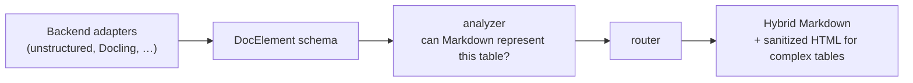

# hybridmd

Convert parsed document elements into **hybrid Markdown** — Markdown wherever it's lossless, and embedded, sanitized HTML only for the tables whose structure (merged cells, multi-row headers, nesting) Markdown cannot represent.

[](https://github.com/mcravi8/hybridmd/actions/workflows/ci.yml)
[](LICENSE)


## The problem

Feeding documents to an LLM usually means flattening them to Markdown. That works — until a table has merged cells, grouped multi-row headers, or nested content. Markdown's pipe syntax can express none of those, so the table is **silently corrupted**: cells slide under the wrong headers, column grouping disappears, subtotals detach from their rows. Nothing raises. The output still looks like a perfectly valid table, so the damage is invisible everywhere downstream — a financial statement can reach the model with its numbers under the wrong quarters and no signal that anything went wrong.

Converting *everything* to HTML instead preserves every table exactly, but pays HTML's tag overhead on every **simple** table that pipe syntax would have handled for free — tokens spent solving a problem those tables never had. hybridmd decides **per table**: Markdown where it is provably lossless, sanitized HTML only where the structure demands it.

## Fidelity first

Here is one real table from the demo fixture — a segment-revenue statement with FY-grouped quarter columns and a rowspan subtotal — rendered both ways:

<table>
<tr>
<td>
<b><code>force="md"</code> — corrupted, yet still looks like a table</b>
<pre>
| Segment | FY2025 ($M) | FY2024 ($M) |
| --- | --- | --- |
| Q3 | Q4 | Q3 | Q4 |
| North America | 412 | 438 | 388 | 401 |
| Europe | 256 | 271 | 241 | 249 |
| Asia-Pacific | 180 | 197 | 165 | 172 |
| Total revenue | 848 | 906 | 794 | 822 |
| Net of $12M intersegment eliminations |
</pre>
The header declares 3 columns; the data rows have 5. Which quarters belong to FY2025 is lost, and the subtotal row no longer lines up.
</td>
<td>
<b>hybrid — faithful (sanitized HTML)</b>
<table><thead><tr><th rowspan="2">Segment</th><th colspan="2">FY2025 ($M)</th><th colspan="2">FY2024 ($M)</th></tr><tr><th>Q3</th><th>Q4</th><th>Q3</th><th>Q4</th></tr></thead><tbody><tr><td>North America</td><td>412</td><td>438</td><td>388</td><td>401</td></tr><tr><td>Europe</td><td>256</td><td>271</td><td>241</td><td>249</td></tr><tr><td>Asia-Pacific</td><td>180</td><td>197</td><td>165</td><td>172</td></tr><tr><td rowspan="2">Total revenue</td><td>848</td><td>906</td><td>794</td><td>822</td></tr><tr><td colspan="4">Net of $12M intersegment eliminations</td></tr></tbody></table>
The merged headers, the quarter grouping, and the subtotal all survive.
</td>
</tr>
</table>

Under `force="md"`, **1 of 2 tables in that fixture is corrupted** — emitted as Markdown despite structure Markdown cannot hold. hybridmd routes that table to HTML and leaves the simple one as clean pipes.

## Then, tokens

Fidelity is the point; tokens are the tradeoff. Counts below use tiktoken's `cl100k_base` encoding and are tokenizer-specific:

**`demo_elements.json` — 1 simple + 1 complex table**

| mode | tokens | Δ vs hybrid | lossy |
| --- | --- | --- | --- |
| hybrid | 501 | — | no |
| `force="html"` | 563 | +62 (+12.4%) | no |
| `force="md"` | 366 | −135 (−26.9%) | **yes — 1 of 2 tables corrupted** |

**`table_heavy_elements.json` — 6 simple + 1 complex table**

| mode | tokens | Δ vs hybrid | lossy |
| --- | --- | --- | --- |
| hybrid | 873 | — | no |
| `force="html"` | 1259 | +386 (+44.2%) | no |
| `force="md"` | 738 | −135 (−15.5%) | **yes — 1 of 7 tables corrupted** |

hybrid costs slightly more than the lossy mode and less than the safe mode, **while matching the safe mode's fidelity exactly**. The saving over `force="html"` scales with the proportion of simple tables — roughly 63 tokens of HTML overhead avoided per simple table — so the `force="html"` premium grows from +12.4% on the 2-table fixture to +44.2% on the table-heavy one. Regenerate these numbers with `python scripts/token_report.py` (needs the `bench` extra).

## Quickstart

```bash
pip install hybridmd
```

```python
from hybridmd import render
from hybridmd.adapters.unstructured_io import from_unstructured
from unstructured.partition.auto import partition  # needs hybridmd[unstructured]

elements = from_unstructured(partition(filename="report.pdf"))
print(render(elements))
```

Or use the CLI, which accepts either a JSON list of elements or any document the backend can parse:

```bash
# A JSON list of hybridmd DocElement dicts or unstructured element dicts:
hybridmd elements.json -o out.md

# Any document, parsed via the unstructured backend:
hybridmd report.pdf --annotate
```

Optional extras:

```bash
pip install "hybridmd[unstructured]"   # the Unstructured backend adapter
pip install "hybridmd[bench]"          # tiktoken, for scripts/token_report.py
```

## Architecture



The `DocElement` schema is the seam that makes backends swappable: adapters produce `DocElement`s, and everything downstream — analyzer, router, serializers — depends only on the schema, never on a backend's own types.

## Annotations

With `annotate=True`, each table is preceded by a machine-readable marker on its own line:

```
<!-- hybridmd: table format=html reasons=merged_cells,multi_row_header -->
```

It exists for two reasons. Downstream chunkers can treat each table as an **atomic chunk** — keying off the marker to never split a table mid-way. And lossy benchmark runs are **self-documenting**: under `force="md"` the marker still reports the analyzer's real reasons (e.g. `format=md reasons=merged_cells forced=true`), recording exactly which tables were mangled.

## Design decisions

- **bs4-only core.** The core package depends only on `beautifulsoup4`; backend adapters and dev tooling live behind optional extras, so a core install and core CI stay lean.
- **HTML5 span parsing, not `int()`.** `colspan`/`rowspan` are parsed by the HTML5 "rules for parsing non-negative integers" — the longest leading run of ASCII digits — because a browser renders `colspan="2abc"` as `2`. Plain `int()` raises on that and would fall back to "not merged", which is the **unsafe** direction: under-detecting a merged cell emits lossy Markdown, whereas over-detecting merely routes to (lossless) HTML.
- **Force modes are for benchmarking.** `force="html"` and `force="md"` override the analyzer for measurement only; `force="md"` is documented as explicitly lossy and exists to quantify the tradeoff, not for production use.

## Roadmap

- A **Docling** adapter, following the same duck-typed, extra-gated pattern as the Unstructured one (no backend import in core).
- A separate **downstream package for financial documents** — caption binding, footnote resolution, numeric validation — explicitly out of scope here. hybridmd stays a focused, backend-neutral converter; domain logic layers on top of it.

---

MIT licensed. **v1 in progress.**
